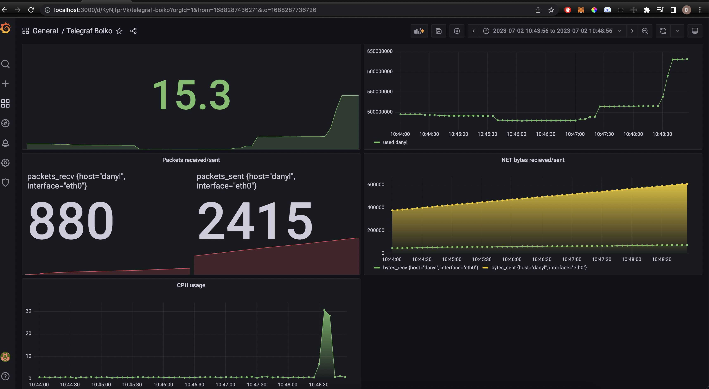

# Telegraf, InfluxDB, Grafana (TIG) Stack

TIG Monitoring

Clone the project

```bash
git clone https://github.com/danylboiko95/TIG-monitoring.git
```

Navigate to the project directory

```bash
cd TIG-monitoring
```

Start the services

```bash
docker-compose up -d
```

[**Telegraf**](https://hub.docker.com/_/telegraf) / `1.19`

[**InfluxDB**](https://hub.docker.com/_/influxdb) / `2.1.1`

[**Grafana-OSS**](https://hub.docker.com/r/grafana/grafana-oss) / `8.4.3`



